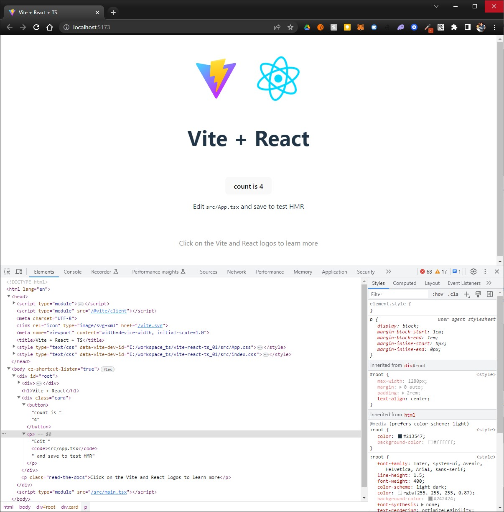

# vite-react-ts_01

References:
* [vitejs](https://vitejs.dev/guide/)
* [react-devtools](https://reactjs.org/link/react-devtools)

## 1. Setup
```sh
$ yarn create vite vite-react-ts_01 --template react-ts
yarn create v1.22.15
[1/4] Resolving packages...
[2/4] Fetching packages...
[3/4] Linking dependencies...
[4/4] Building fresh packages...

success Installed "create-vite@4.4.0" with binaries:
      - create-vite
      - cva

Scaffolding project in E:\workspace_ts\vite-react-ts_01...

Done. Now run:

  cd vite-react-ts_01
  yarn
  yarn dev
```

